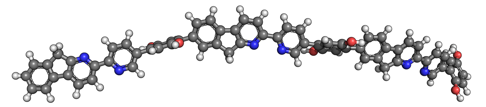
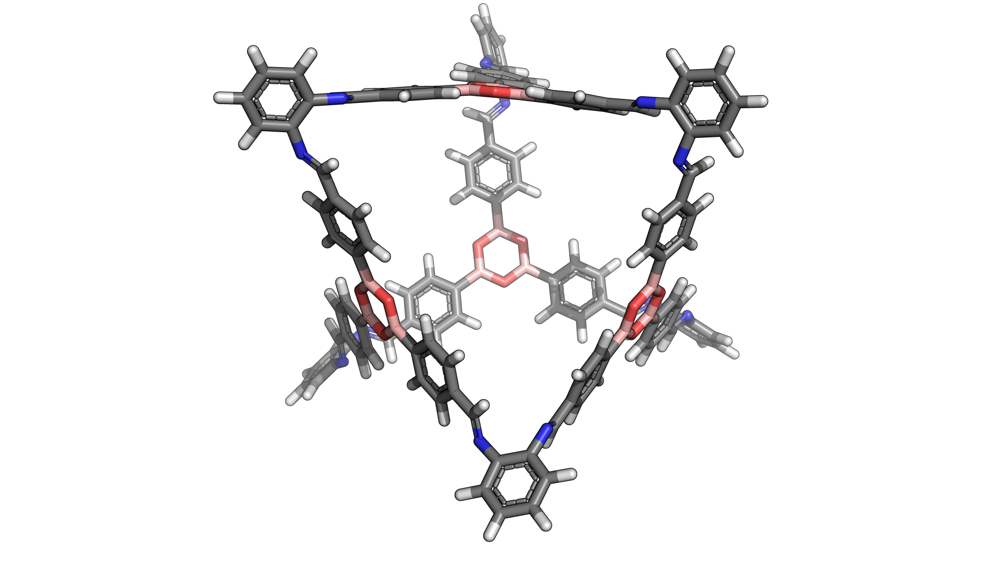
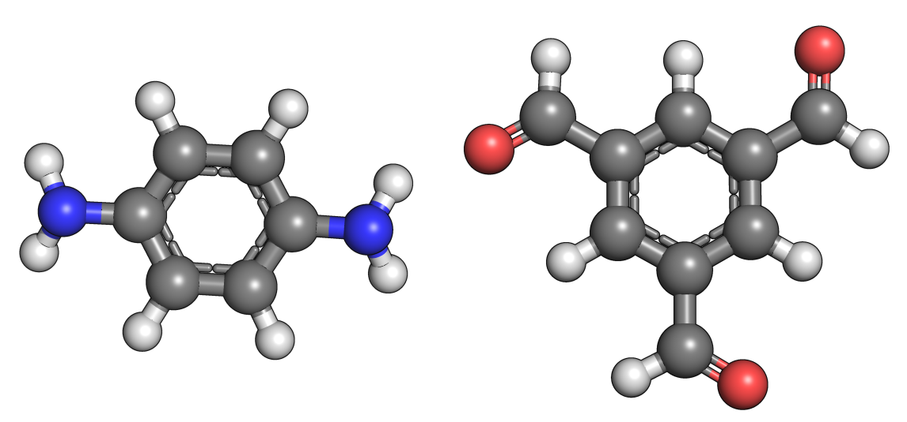

.. stk documentation master file, created by
   sphinx-quickstart on Mon Nov 13 11:15:04 2017.
   You can adapt this file completely to your liking, but it should at least
   contain the root `toctree` directive.

Welcome to ``stk``'s documentation!
===================================

GitHub: https://www.github.com/lukasturcani/stk

.. toctree::
   :maxdepth: 2
   :caption: Contents:

Overview
--------

``stk`` is a Python 3 library for building, manipulating, optimizing
and designing molecules.

Basic Examples
--------------

Linear Polymer
..............

The core function of ``stk`` is to assemble molecules. Here is an example
of how a simple, linear polymer can be built. Starting with three monomers,
such as

.. image:: figures/monomers.png

each can be loaded into a :class:`.StructUnit2` object from a molecular
structure file:

.. code-block:: python

    monomer1 = StructUnit2('monomer1.mol', 'bromine')
    monomer2 = StructUnit2('monomer2.mol', 'bromine')
    monomer3 = StructUnit2('monomer3.mol', 'bromine')

The first argument is the path to the structure file and the second
argument specifies the functional group of the monomer.

To assemble a polymer only a single line of code is required:

.. code-block:: python

    polymer = Polymer([monomer1, monomer2, monomer3], Linear('ABC', [0, 1, 0.5], n=3))

Simply create a :class:`.Polymer` object by giving it a list of
monomers and a topology object, in this
case :class:`.Linear`. The topology object defines the the structure of
the polymer being assembled. The repeating unit is ``'ABC'``, the orientation
of the each monomer along the chain is parallel, anti-parallel and random, respectively, and
the number of repeating units is ``3``.

The assembled polymer can be written to a file

.. code-block:: python

    polymer.write('polymer.mol')

and will look like this.

.. image:: figures/polymer.png

Notice that the functional group has disappeared and been replaced by
new bonds between the monomers. The new bonds seem a little stretched,
so we can optimize the structure using an optimization function defined in
:mod:`~.optimization.optimization`, in this case :func:`.rdkit_ETKDG`

.. code-block:: python

    rdkit_ETKDG(polymer)

Again, the polymer can be written to a file

.. code-block:: python

    polymer.write('polymer_opt.mol')

and viewed

Molecular Cages
...............

Molecular cages are relatively
exotic molecules that look like, yes, cages. Here is an example:

Despite their apparent complexity, assembling a molecular cage is
extremely straightforward. In fact, it is done in exactly the same way
as a polymer.

First we define the building blocks of the cage:

.. code-block:: python

    bb1 = StructUnit2('bb1.mol', 'amine')
    bb2 = StructUnit3('bb2.mol', 'aldehyde')

Here is what they look like:

.. image:: figures/cage_building_blocks.png

Notice a slight difference, while the first building building block still
uses the class :class:`.StructUnit2`, the second uses the class
:class:`.StructUnit3`. The reason is that the first building block has
2 functional groups while the second has 3 functional groups. Each class
defines a slightly different set of operations for manipulating the
positions of the building blocks when assembling the cage. This is
important so that the building blocks are placed exactly how we want them
when constructing a molecule. However, all of this happens behind the scenes
and a cage can be constructed through a simple one-liner:

.. code-block:: python

    cage = Cage([bb1, bb2], FourPlusSix())

Notice that this is exactly the same as the polymer example. To generate
a cage, we simply create a :class:`.Cage` object. We initialize it with
a list of building blocks and provide a topology instance, in this case
:class:`.FourPlusSix`. Unlike the :class:`.Linear` class, the :class:`.FourPlusSix`
does not require any additional arguments. Our assembled cage looks like
this

.. image:: figures/cage.png

If we want to create a cage with a different topology but using the same
building blocks, we provide a different topology instance:

.. code-block:: python

    cage2 = Cage([bb1, bb2], EightPlusTwelve())

The assembled cage looks like a cube:

.. image:: figures/cage2.png

Notice that the building blocks are the same, only the shape has changed.
This is because a different topology instance was provided during initialization.

Here is a third example:

.. code-block:: python

    cage3 = Cage([bb1, bb2], Dodecahedron())

.. image:: figures/cage3.png

While we assembled some cages, the constructed structures are not
particularly realistic. We can optimize the geometry using an optimization
function:

.. code-block:: python

    macromodel_opt(cage, '/opt/schrodinger2017-4')
    macromodel_opt(cage2, '/opt/schrodinger2017-4')
    macromodel_opt(cage3, '/opt/schrodinger2017-4')

.. image:: figures/cages_opt.png

In this case the function :func:`.macromodel_opt` was used. We could have
used :func:`.rdkit_ETKDG` again but chances are the structures would
have been optimized quite poorly. The :func:`.macromodel_opt` function
requires a valid ``MacroModel`` installation with a working license.
The argument ``'/opt/schrodinger2017-4'`` is the path to the installation.

Covalent Organic Frameworks
...........................

Just like the other molecules, covalent organic frameworks (COFs) are easy to
construct:

.. code-block:: python

    bb1 = StructUnit2('cof_bb1.mol', 'amine')
    bb2 = StructUnit3('cof_bb2.mol', 'aldehyde'))
    cof = Periodic([bb1, bb2], Honeycomb())

Where the buliding blocks are:

The same pattern is used. First building blocks objects are created using
:class:`StructUnit3` instances. Then a molecule is assembled by creating
an instance of its class, in this case :class:`.Periodic`. The molecule
being assembled is provided with the building blocks and the topology,
in this case :class:`.Honeycomb`.

Because COFs are periodic structures, if we want to make a finite size
molecule we have to create an "island":

.. code-block:: python

    cof.island([5, 5, 1])

Here we created create a 5 by 5 by 1 grid of the periodic unit cell.
This is a cut-out of our structure:

.. image:: figures/honey.png

Other COF topologies are available in :mod:`.topologies.cof`. For example:

:class:`.Hexagonal`

.. image:: figures/hex.png

:class:`.Square`

.. image:: figures/square.png

:class:`.Kagome`

.. image:: figures/kagome.png

Other Materials
...............

``stk`` is a work in progress and currently supports only the above classes
of materials out of the box. However, ``stk`` was designed to be easy
extend to other classes of molecules.
For a guide on how this can be done
see, :ref:`extending stk`.

Other Features
--------------

Calculating Molecular Properties
................................

``stk`` provides a variety of methods to calculate molecular properties.
What methods can be used depends on what kind of molecule object is created.
All molecules can use methods defined in :class:`.Molecule`. All
building blocks can use methods in :class:`.StructUnit` in addition to this.
Assembled molecules can use additional methods provided by :class:`.MacroMolecule`.

Here are some examples:

.. code-block:: python

    # Calculate the energy of a molecule using rdkit and the UFF force field.
    mol.energy.rdkit('uff')
    # Calculate the energy of a molecule using MacroModel. Using force field
    # number 16 (OPLS3).
    mol.energy.marcomodel(16, '/opt/schrodinger2017-4')
    # Calculate the maximum diameter of of a molecule.
    mol.max_diameter()
    # Calculate the cavity size of a cage molecule.
    cage.cavity_size()
    # Calculate the mean RMSD between the building blocks original
    # structure and their structure inside an assembled macromolecule.
    macro_mol.bb_distortion()
    # Get the center of mass of a molecule.
    mol.center_of_mass()
    # Get the atomic symbol of atom with id of 13.
    mol.atom_symbol(13)

Geometric Manipulations
.......................

In addition to molecular property calculation, ``stk`` provides tools to
rotate and translate molecules. These tools are particularly useful when
defining the assembly process of a new class of molecules.

.. code-block:: python

    # Change the position of a molecule.
    mol.set_position([1, 2, 3])
    # Get a matrix holding the position of every atom in the molecule.
    mol.position_matrix()
    # Use a matrix to set the position of every atom in the molecule.
    mol.set_position_from_matrix(some_matrix)
    # Rotate the molecule along by pi radians about the vector (1, 1, 3)
    mol.rotate(np.pi, [1, 1, 2])

Dealing with Multiple Molecules
...............................

When batches of molecules are created, it is often desirable to optimize
them all at once. By placing the molecules in a :class:`.Population`
instance, all molecules can be optimized in parallel.

.. code-block:: python

    pop = Population(cage, cage2, cage3)
    pop.optimize(FunctionData('macromodel_opt', macromodel_path='/opt/schrodinger2017-4'))

In addition to this, the :class:`.Population` class provides some handy
tools to assemble large amounts of molecules at a time. For example if
we want to create every possible cage from a set of building blocks and
topologies:

.. code-block:: python

    bbs1 = [StructUnit2(path, 'aldehyde') for path in ('1.mol', '2.mol', '3.mol')]
    bbs2 = [StructUnit3(path, 'amine') for path in ('4.mol', '5.mol', '6.mol')]
    # Create 18 Cage molecules.
    pop2 = Population.init_all(Cage, [bbs1, bbs2], [FourPlusSix(), EightPlusTwelve()])

Or if we want to select building blocks at random and create 5 cages:

.. code-block:: python

    pop3 = Population.init_random(Cage, [bbs1, bbs2], [FourPlusSix(), EightPlusTwelve()], 5)

Finally, the population can be used to calculate statistics across all
molecules. For example, if you want to know the average cavity size of
your cages:

.. code-block:: python

    pop.mean(lambda x: x.cavity_size())

Automated Molecular Design with Genetic Algorithms
..................................................

Via the :mod:`.ga` module, ``stk`` includes a genetic algorithm which
can be used to evolve molecules that fulfil user defined design criteria.
The genetic algorithm can be run from the command line using::

    $ python -m stk input_file.py

The input file is a simple python script which defines the mutation,
crossover, selection and other functions the genetic algorithm
should use. For details on how to build and input file see :class:`.GAInput`.

The genetic algorithm automatically works with any molecules that ``stk``
can construct, just make sure you define an appropriate fitness function.

.. _`extending stk`:

Extending ``stk``
-----------------

Each module of ``stk`` has its own guidelines for adding new functionality.
However, in almost all cases adding new features to ``stk`` only involves
defining a simple function in the appropriate module or a method in the
appropriate class.

    * :ref:`adding macromolecules`
    * :ref:`adding topologies`
    * :ref:`adding functional groups`
    * :ref:`adding optimization functions`
    * :ref:`adding energy functions`
    * :ref:`adding mutation functions`
    * :ref:`adding crossover functions`
    * :ref:`adding fitness functions`
    * :ref:`adding normalization functions`
    * :ref:`adding selection functions`
    * :ref:`adding exit functions`

Further Reading
---------------

    * :ref:`macromolecular assembly`
    * :ref:`cof assembly`

Indices and tables
==================

* :ref:`genindex`
* :ref:`modindex`
* :ref:`search`
