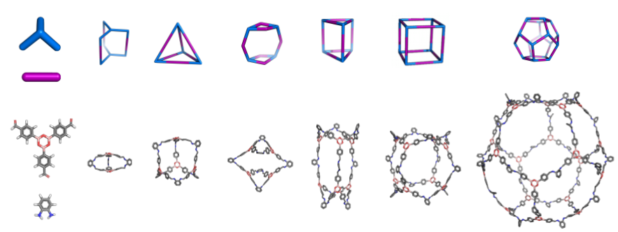
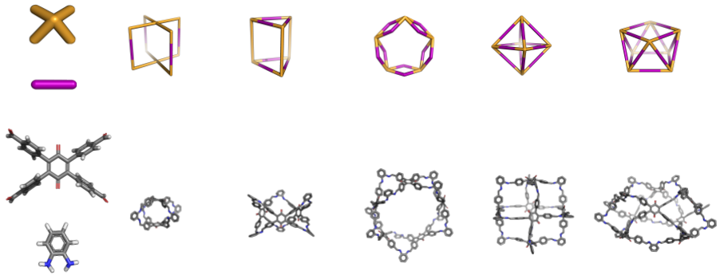
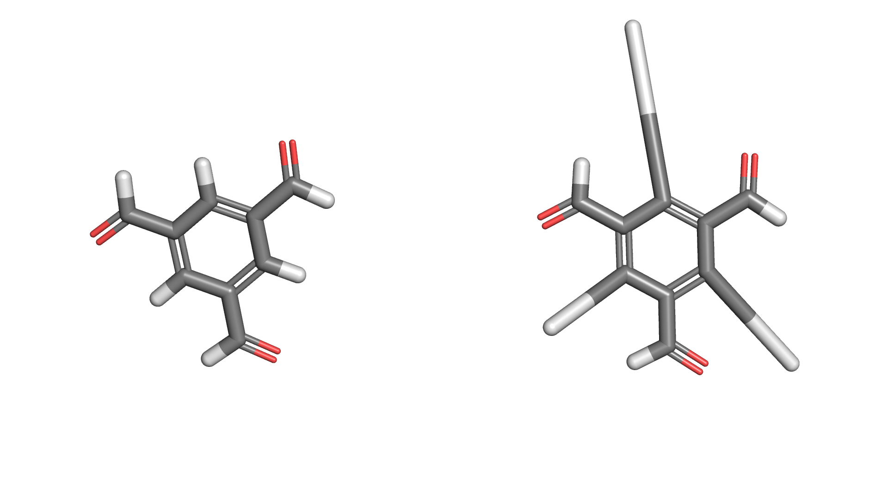
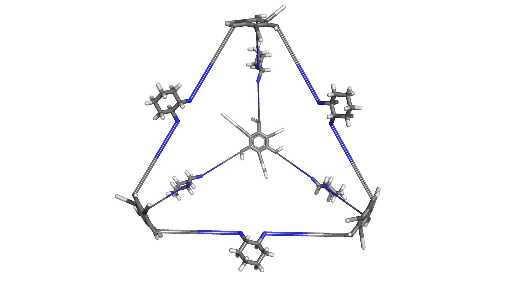
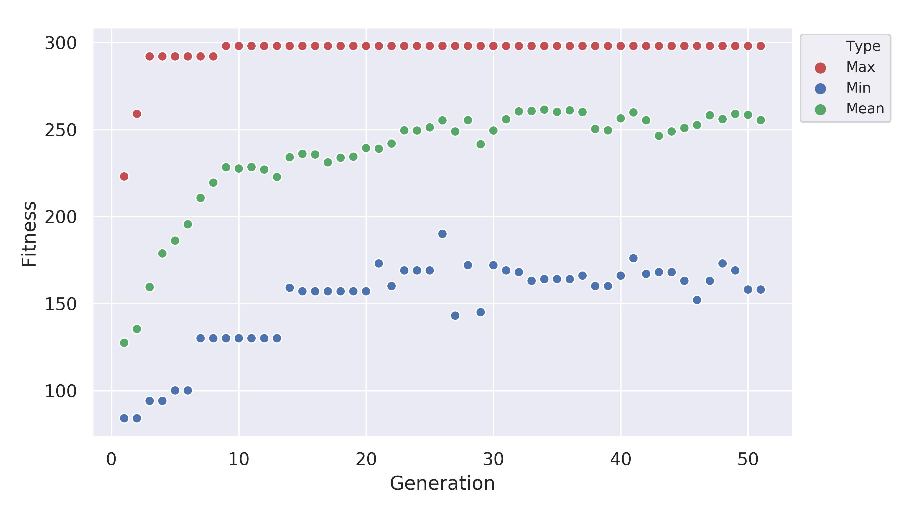

.. stk documentation master file, created by
   sphinx-quickstart on Mon Nov 13 11:15:04 2017.
   You can adapt this file completely to your liking, but it should at least
   contain the root `toctree` directive.

.. toctree::
   :hidden:
   :caption: stk
   :maxdepth: 2

   Developer Guide <developer_guide>
   One Two Three <cookbook>

.. toctree::
    :hidden:
    :caption: Molecules
    :maxdepth: 2

    Building Block <stk.molecular.molecules.building_block>
    Constructed Molecule <stk.molecular.molecules.constructed_molecule>

.. toctree::
    :hidden:
    :caption: Topology Graphs
    :maxdepth: 2

    Topology Graph <stk.molecular.topology_graphs.topology_graph>
    Polymer <stk.molecular.topology_graphs.polymer>
    Organic Cage <stk.molecular.topology_graphs.cage>
    Covalent Organic Framework <stk.molecular.topology_graphs.cof>
    Host Guest Complex <stk.molecular.topology_graphs.host_guest>
    Macrocycle <stk.molecular.topology_graphs.macrocycle>
    Rotaxane <stk.molecular.topology_graphs.rotaxane>

.. toctree::
    :hidden:
    :caption: Genetic Algorithm
    :maxdepth: 2

    Introduction <stk.ga>
    Fitness Calculators <stk.calculators.ga.fitness_calculators>
    Fitness Normalizers <stk.calculators.ga.fitness_normalizers>
    Selection <stk.calculators.ga.selectors>
    Mutation <stk.calculators.ga.mutators>
    Crossover <stk.calculators.ga.crossers>
    Termination <stk.calculators.ga.exiters>
    Plotting <stk.calculators.ga.plotters>

Welcome to ``stk``!
-------------------

GitHub: https://www.github.com/lukasturcani/stk

Slack: https://t.co/LCPzWhvsVO


Overview
--------

``stk`` is a Python library for which allows the construction,
manipulation and automatic design of molecules. Automated design is
achieved through a genetic algorithm.

For quick navigation through the modules of ``stk``, use
:ref:`modindex`.

Basic Examples
--------------

Linear Polymer
..............

The core function of ``stk`` is to assemble molecules. Here is an example
of how a simple, linear polymer can be built. Starting with three monomers,
such as

.. image:: figures/monomers.png

each can be loaded into a :class:`.StructUnit2` object from a molecular
structure file:

.. code-block:: python

    import stk
    monomer1 = stk.BuildingBlock.init_from_file(
        path='monomer1.mol',
        functional_groups=['bromine']
    )
    monomer2 = StructUnit2('monomer2.mol', ['bromine'])
    monomer3 = StructUnit2('monomer3.mol', ['bromine'])

The first argument is the path to the structure file and the second
argument specifies the reactive functional groups of the monomer.

To assemble a polymer only a single line of code is required:

.. code-block:: python

    polymer = Polymer([monomer1, monomer2, monomer3], Linear('ABC', [0, 1, 0.5], n=3))

Simply create a :class:`.Polymer` object by giving it a list of
monomers and a topology object, in this
case :class:`.Linear`. The topology object defines the the structure of
the polymer being assembled. The repeating unit is ``'ABC'``, the orientation
of the each monomer along the chain is parallel, anti-parallel and random, respectively, and
the number of repeating units is ``3``.

The assembled polymer can be written to a file

.. code-block:: python

    polymer.write('polymer.mol')

and will look like this.

.. image:: figures/polymer.png

Notice that the functional group has disappeared and been replaced by
new bonds between the monomers. The new bonds seem a little stretched,
so we can optimize the structure using an :class:`.Optimizer`
defined in :mod:`~.calculator.optimization`, in this case
:class:`.MMFF`

.. code-block:: python

    mmff = MMFF()
    mmff.optimize(polymer)

Again, the polymer can be written to a file

.. code-block:: python

    polymer.write('polymer_opt.mol')

and viewed

.. image:: figures/polymer_opt.png

``stk`` also allows you to save the Python objects themselves in the JSON
format.

.. code-block:: python

    polymer.dump('polymer.json')

This allows you to restore a :class:`.Molecule` object from a previous session.

.. code-block:: python

    polymer = Molecule.load('polymer.json')
    polymer # < Polymer NOT Molecule object >

:meth:`.Molecule.load` allows you to load any dumped ``stk`` JSON object
regardless of its class and it will returned an object of the correct
class to you.

Molecular Cages
...............

Molecular cages are relatively
exotic molecules that look like, yes, cages. Here is an example:

.. image:: figures/molecular_cage.png

Despite their apparent complexity, assembling a molecular cage is
extremely straightforward. In fact, it is done in exactly the same way
as a polymer.

First we define the building blocks of the cage:

.. code-block:: python

    bb1 = StructUnit2('bb1.mol', ['amine'])
    bb2 = StructUnit3('bb2.mol', ['aldehyde'])

Here is what they look like:

.. image:: figures/cage_building_blocks.png

Notice a slight difference, while the first building building block still
uses the class :class:`.StructUnit2`, the second uses the class
:class:`.StructUnit3`. The reason is that the first building block has
2 functional groups while the second has 3 functional groups. Each class
defines a slightly different set of operations for manipulating the
positions of the building blocks when assembling the cage. This is
important so that the building blocks are placed exactly how we want them
when constructing a molecule. However, all of this happens behind the scenes
and a cage can be constructed through a simple one-liner:

.. code-block:: python

    cage = Cage([bb1, bb2], FourPlusSix())

Notice that this is exactly the same as the polymer example. To generate
a cage, we simply create a :class:`.Cage` object. We initialize it with
a list of building blocks and provide a topology instance, in this case
:class:`.FourPlusSix`. Unlike the :class:`.Linear` class, the :class:`.FourPlusSix`
does not require any additional arguments. Our assembled cage looks like
this

.. image:: figures/cage.png

If we want to create a cage with a different topology but using the same
building blocks, we provide a different topology instance:

.. code-block:: python

    cage2 = Cage([bb1, bb2], EightPlusTwelve())

The assembled cage looks like a cube:

.. image:: figures/cage2.png

Notice that the building blocks are the same, only the shape has changed.
This is because a different topology instance was provided during initialization.

Here is a third example:

.. code-block:: python

    cage3 = Cage([bb1, bb2], Dodecahedron())

.. image:: figures/cage3.png

While we assembled some cages, the constructed structures are not
particularly realistic. We can optimize the geometry using an
:class:`.Optimizer`:

.. code-block:: python

    macromodel = MacroModelForceField(
        macromodel_path='/opt/schrodinger2017-4'
    )
    macromodel.optimize(cage)
    macromodel.optimize(cage2)
    macromodel.optimize(cage3)

.. image:: figures/cages_opt.png

In this case the optimizer :class:`.MacroModelForceField` was used.
We could have used :class:`.MMFF` again but chances are the structures
would have been optimized quite poorly. The
:class:`.MacroModelForceField` optimizer
requires a valid ``MacroModel`` installation with a working license.
The argument ``'/opt/schrodinger2017-4'`` is the path to the installation.

Note that there are many more cage topologies available (14+), which
can be found by looking in :mod:`stk.molecular.topologies.cage`.





.. image:: figures/cages_three_plus_four.png

.. image:: figures/cages_three_plus_three.png

The topologies are organized into submodules based on the building blocks
required to build them. For example, all topologies in the
:mod:`stk.molecular.topologies.cage.two_plus_three` submodule are composed of two and three functionalized building
blocks, all cages in the :mod:`stk.molecular.topologies.cage.two_plus_four` submodule are composed of two and
four functionalized building blocks, cages in :mod:`stk.molecular.topologies.cage.three_plus_three` are composed
of three functionalized building blocks and so on.

All cage topologies also support being built from more than two building
blocks, to produce mixed or multi-component cages.

.. image:: figures/advanced_cage_assembly/multi_cage.png

In addition, cage topologies support a number of optional arguments which allow the many
possible structural isomers to be easily assembled. These topics are
discussed in :doc:`advanced_cage_building`.

Covalent Organic Frameworks
...........................

Just like the other molecules, covalent organic frameworks (COFs) are easy to
construct:

.. code-block:: python

    bb1 = StructUnit2('cof_bb1.mol', ['amine'])
    bb2 = StructUnit3('cof_bb2.mol', ['aldehyde']))
    cof = Periodic([bb1, bb2], Honeycomb())

Where the buliding blocks are:

.. image:: figures/cof_bbs.png

The same pattern is used. First building blocks objects are created using
:class:`.StructUnit3` instances. Then a molecule is assembled by creating
an instance of its class, in this case :class:`.Periodic`. The molecule
being assembled is provided with the building blocks and the topology,
in this case :class:`.Honeycomb`.

Because COFs are periodic structures, if we want to make a finite size
molecule we have to create an "island":

.. code-block:: python

    cof.island([5, 5, 1])

Here we created create a 5 by 5 by 1 grid of the periodic unit cell.
This is a cut-out of our structure:

.. image:: figures/honey.png

Other COF topologies are available in :mod:`.topologies.cof`. For example:

:class:`.Hexagonal`

.. image:: figures/hex.png

:class:`.Square`

.. image:: figures/square.png

:class:`.Kagome`

.. image:: figures/kagome.png

``stk`` also gives tools to build a large number of structural isomers
of each COF. This is done analogously to the organic cage case so reading
:doc:`advanced_cage_building` is recommended.

Other Materials
...............

Other materials defined by ``stk`` can be found in
:mod:`.molecular.topologies`. In addition to this, ``stk`` was designed
to be easy extend to other classes of molecules. For a guide on how this
can be done see, :ref:`extending stk`.


Calculators
-----------

``stk`` makes extensive use of calculator objects. Calculators are a
very general pattern for performing operations on molecules. All
calculators are objects with a special method, used to perform the
calculation. You have already been introduced to one type of calculator,
the :class:`.Optimizer`. An optimizer has a special method called
:meth:`~.Optimizer.optimize`, which optimizes a molecule. Here is
another example

.. code-block:: python

    mol = StructUnit(...)
    polymer = Polymer(...)

    optimizer1 = MMFF()

    # Optimize mol with mmff.
    optimizer1.optimize(mol)
    # Optimize polymer conformer 2 with mmff.
    optimizer2.optimize(polymer, conformer=2)

Other types of calculators will have different special methods used to
perform calculations on molecules. For example, an
:class:`.EnergyCalculator` will define an
:meth:`~.EnergyCalculator.energy` method. This method calculates the
energy of the molecule

.. code-block:: python

    mmff_energy = MMFFEnergy()
    uff_energy = UFFEnergy()

    # Calculate the energy of mol conformer 1 with the mmff force field.
    mol_mmff_energy = mmff_energy.energy(mol, conformer=1)

    # Calculate the energy of polymer conformer 10 with the uff force field.
    polymer_uff_energy = uff_energy.energy(polymer, conformer=10)

All genetic algorithm operations are also implemented through
calculators, take for example a :class:`.Mutator` such as
:class:`.RandomTopology`

.. code-block:: python

    topologies = [EightPlusTwelve(), FourPlusSix(), Dodecahedron()]
    random_top = RandomTopology(topologies)

    # Assume bb1 and bb2 are StructUnit2 and StructUnit3 objects.
    cage = Cage([bb1, bb2], SixPlusNine())

    # Perform a mutation.
    mutant = random_top.mutate(cage)

A :class:`.Mutator` is a calculator which implements a
:meth:`~.Mutator.mutate` method. This method takes a molecule and
returns a mutant, *i.e.* a modified version, of that molecule.
In this example, the ``random_top`` is a :class:`.Mutator`, which replaces
the topology of a molecule with a new one, in order to generate the mutant.
In this case, the new topologies would be one of :class:`.EightPlusTwelve`,
:class:`.FourPlusSix` or :class:`.Dodecahedron`.

Calculators often support additional options to modify their behaviour.
For example, calculators of type :class:`.Optimizer` or
:class:`.EnergyCalculator` support caching. This means that if the
same molecule and conformer is supplied to the calculator, it will not
run the optimization or energy calculation again, it will return the
previously calculated value

.. code-block:: python

    # Example of caching with optimizers.
    mmff = MMFF()
    caching_mmff = MMFF(use_cache=True)

    mol = StructUnit(...)

    # Performs an optimization on mol.
    mmff.optimize(mol)
    # Performs a second optimization on mol.
    mmff.optimize(mol)

    # Performs an optimization on mol.
    cached_mmff.optimize(mol)
    # Does not peform an optimization on mol.
    cached_mmff.optimize(mol)

    # Make a non-caching and a caching uff energy calculator.
    uff_energy = UFFEnergy()
    caching_uff_energy = UFFEnergy(use_cache=True)

    # Calculate the energy twice.
    uff_energy.energy(mol)
    uff_energy.energy(mol)

    # Calculate the energy.
    caching_uff_energy.energy(mol)
    # Does not calculate the energy again, returns the previous value.
    caching_uff_energy.energy(mol)

More information on each type of calculator can be seen by visiting the
following modules:

    * :mod:`.optimization`
    * :mod:`.energy`
    * :mod:`.electronic_property`
    * :mod:`.mutators`
    * :mod:`.crossers`
    * :mod:`.fitness_calculators`
    * :mod:`.fitness_normalizers`
    * :mod:`.selectors`
    * :mod:`.exiters`
    * :mod:`.plotters`

Combining Calculators
.....................

Calculators can be combined to create complex behaviour on the fly.
For example, we may wish to make a 2 step optimization process. First,
we perform an optimization using the MMFF force field and the run
a MacroModel molecular dynamics conformer search with
:class:`.MacroModelMD`. The obvious way to do
this is to run the two optimizers in sequence

.. code-block:: python

    mmff = MMFF()
    macromodel = MacroModelMD(macromodel_path='/opt/schrodinger2017-4')

    mmff.optimize(mol)
    macromodel.optimize(mol)

However, there is a better way! We can use an optimizer called
:class:`.OptimizerSequence`. The :meth:`~.OptimizerSequence.optimize`
method of this optimizer calls the :meth:`~.Optimizer.optimize` methods
of the optimizers it was initialized with

.. code-block:: python

    opt_sequence = OptimizerSequence(mmff, macromodel)
    # Optimize with mmff and then with macromodel.
    opt_sequence.optimize(mol)

This pattern is quite common and powerful. For example, we can take
three different :class:`.Mutator` objects. Each of these defines
a different :meth:`~.Mutator.mutate` method. We want to apply one of
these mutations at random. We can simply use :class:`.RandomMutation`

.. code-block:: python

    random_bb = RandomBuildingBlock(...)
    similar_bb = SimilarBulidingBlock(...)
    random_topology = RandomTopology(...)

    random_mutation = RandomMutation(
        random_bb,
        similar_bb,
        random_topology
    )

    # Use one of the mutate() methods of random_bb, similar_bb and
    # random_topology at random.
    mutant1 = random_mutation.mutate(mol)
    # The next call use a different mutation to the call above.
    mutant2 = random_mutation.mutate(mol)

The :meth:`.RandomMutation.mutate` method randomly selects a
:class:`.Mutator` it was initialized with to carry out the mutation
on its behalf.

Making New Calculators
......................

New calculators can be added very simply and they can be defined in
user code. Specific guidelines are defined in the module
dedicated to each type of calculator in :mod:`.calculators`.

A simple example of adding a new calculator in user code.

.. code-block:: python

    class NewEnergyCalculator(EnergyCalculator):
        def energy(self, mol, conformer=-1):
            return 15

    energy_calc = NewEnergyCalculator()
    # Calculate the energy with the new calculator.
    energy_calc.energy(mol)


Note that you can also modify the behaviour of existing calculators in
your code, some common patterns are described in
:doc:`modifying_calculators`.

Saving Calculator Results
.........................

If you want to save the results which your calculator found you should
set ``use_cache=True`` and then you can simply use :mod:`pickle`
to dump and load the calculator object. You can inspect the saved
values by looking at the :attr:`cache` attribute.

Calculating Molecular Properties
................................

``stk`` provides a variety of methods to calculate molecular properties.
What methods can be used depends on what kind of molecule object is created.
Note that all molecules can use methods defined in :class:`.Molecule`.

Here are some examples:

.. code-block:: python

    # Calculate the maximum diameter of of a molecule.
    mol.max_diameter()
    # Calculate the cavity size of a cage molecule.
    cage.cavity_size()
    # Calculate the mean RMSD between the building blocks original
    # structure and their structure inside an assembled macromolecule.
    macro_mol.bb_distortion()
    # Get the center of mass of a molecule.
    mol.center_of_mass()
    # Get the atomic symbol of atom with id of 13.
    mol.atom_symbol(13)

Geometric Manipulations
.......................

In addition to molecular property calculation, ``stk`` provides tools to
rotate and translate molecules. These tools are particularly useful when
defining the assembly process of a new class of molecules.

.. code-block:: python

    # Change the position of a molecule.
    mol.set_position([1, 2, 3])
    # Get a matrix holding the position of every atom in the molecule.
    mol.position_matrix()
    # Use a matrix to set the position of every atom in the molecule.
    mol.set_position_from_matrix(some_matrix)
    # Rotate the molecule along by pi radians about the vector (1, 1, 3)
    mol.rotate(np.pi, [1, 1, 2])

Dealing with Multiple Conformers
--------------------------------

Every :class:`.Molecule`, be it a :class:`.StructUnit` or a :class:`.MacroMolecule`
supports multiple conformers. These are stored in the underlying
:mod:`rdkit` object held in :class:`.Molecule.mol`.

Adding a new conformer to a :class:`.StructUnit` is simple

.. code-block:: python

    bb1 = StructUnit2('bb1_conf1.mol', ['amine']) # Loads molecule into conformer 0.
    bb1.update_from_mol('bb1_conf2.mol', conformer=1) # Load into conformer 1.

Lets take a look

    .. image:: figures/bb1_confs.png

Well, one is clearly better than the other. At least they are easy to
recognize.

Lets try this with a another building block as well

.. code-block:: python

    bb2 = StructUnit3('bb2_conf1.mol', ['aldehyde'])
    bb2 = bb2.update_from_mol('bb2_conf2.mol')



Also pretty distinguishable. This is good, it makes it easy to show
that you can pick which conformers to use for assembly with :class:`.MacroMolecule`

.. code-block:: python

    cage = Cage([bb1, bb2], FourPlusSix(), bb_conformers=[0, 0])
    cage.add_conformer([0, 1])
    cage.add_conformer([1, 0])
    cage.add_conformer([1, 1])

These are the conformers we produced!

.. image:: figures/1.png



.. image:: figures/3.png

.. image:: figures/4.png

``stk`` will use whichever :class:`.StructUnit` conformers you want, when
constructing conformers of the :class:`.MacroMolecule` itself.

Most methods and functions in ``stk`` also support conformers.

.. code-block:: python

    mol.position_matrix(conformer=1)
    mol.energy.rdkit('uff', conformer=0)
    mol.cavity_size(conformer=1)

    # And so on ...

Dealing with Multiple Molecules
...............................

When batches of molecules are created, it is often desirable to optimize
them all at once. By placing the molecules in a :class:`.Population`
instance, all molecules can be optimized in parallel.

.. code-block:: python

    mmff = MMFF()
    pop = Population(cage, cage2, cage3)
    pop.optimize(mmff)


In addition to this, the :class:`.Population` class provides some handy
tools to assemble large amounts of molecules at a time. For example if
we want to create every possible cage from a set of building blocks and
topologies:

.. code-block:: python

    bbs1 = [StructUnit2(path, ['aldehyde']) for path in ('1.mol', '2.mol', '3.mol')]
    bbs2 = [StructUnit3(path, ['amine']) for path in ('4.mol', '5.mol', '6.mol')]
    # Create 18 Cage molecules.
    pop2 = Population.init_all(Cage, [bbs1, bbs2], [FourPlusSix(), EightPlusTwelve()])

Or if we want to select building blocks at random and create 5 cages:

.. code-block:: python

    pop3 = Population.init_random(Cage, [bbs1, bbs2], [FourPlusSix(), EightPlusTwelve()], 5)

The population can also be used to calculate statistics across all
molecules. For example, if you want to know the average cavity size of
your cages:

.. code-block:: python

    pop.mean(lambda x: x.cavity_size())

Finally, we can use the population to write structure files of
all the molecules to a folder

.. code-block:: python

    pop.write('dirname')

or we can dump the population to a JSON file

.. code-block:: python

    pop.dump('pop.json')

and recover the ``stk`` objects later

.. code-block:: python

    pop.load('pop.json', Molecule.from_dict)
    pop[0] # <StructUnit2 at 0x01283>
    pop[1] # <Periodic at 0x12498>

Automated Molecular Design with Genetic Algorithms
--------------------------------------------------

``stk`` includes a genetic algorithm which
can be used to evolve molecules that fulfil user defined design criteria.
The genetic algorithm can be run from the command line using::

    $ python -m stk.ga input_file.py

The input file is a simple python script which defines the
calculators the genetic algorithm should use, as well as some optional
parameters.

The genetic algorithm automatically works with any molecules that ``stk``
uses, both :class:`.StructUnit` and :class:`.MacroMolecule` objects.

Take for example the following input file which runs the GA on polymers
and selects building blocks which have the most atoms.

.. code-block:: python

    # #####################################################################
    # Imports.
    # #####################################################################

    import stk
    import logging

    # #####################################################################
    # Set the number of cores to use.
    # #####################################################################

    # This argument is optional, will default to use all CPU cores on
    # your PC.
    processes = 1

    # #####################################################################
    # Set logging level.
    # #####################################################################

    # This argument is optional, will default to logging.INFO
    logging_level = logging.DEBUG

    # #####################################################################
    # Toggle the writing of a log file.
    # #####################################################################

    # This argument is optional, will default to True.
    log_file = True

    # #####################################################################
    # Toggle the dumping of generated molecules.
    # #####################################################################

    # This argument is optional, will default to True.
    database_dump = True

    # #####################################################################
    # Toggle the dumping of GA generations.
    # #####################################################################

    # This argument is optional, will default to True.
    progress_dump = True

    # #####################################################################
    # Toggle the dumping of molecules at every generation.
    # #####################################################################

    # This argument is optional, will default to False.
    debug_dumps = False

    # #####################################################################
    # Make a tar archive of the output.
    # #####################################################################

    # This argument is optional, will default to False.
    tar_output = True

    # #####################################################################
    # Initial population.
    # #####################################################################

    # Only the "population" variable must be defined in the input file.
    # The other variables defined in this section are to make the code
    # more readable.

    carbon = 'C'
    building_blocks = [
        stk.StructUnit2.smiles_init(f'[Br]{carbon*i}[Br]', ['bromine'])
        for i in range(2, 27)
    ]

    topologies = [
        stk.Linear('A', [0], 3),
        stk.Linear('A', [0], 6),
        stk.Linear('A', [0], 12)
    ]

    # population holds the initial population of the GA.
    population = stk.GAPopulation.init_random(stk.Polymer,
                                              [building_blocks],
                                              topologies,
                                              25)

    # #####################################################################
    # Selector for selecting the next generation.
    # #####################################################################

    generation_selector = stk.SelectorSequence(
        stk.Fittest(num=3, duplicates=False),
        stk.Roulette(num=22, duplicates=False)
    )

    # #####################################################################
    # Selector for selecting parents.
    # #####################################################################

    crossover_selector = stk.AboveAverage(num=5, batch_size=2)

    # #####################################################################
    # Selector for selecting molecules for mutation.
    # #####################################################################

    mutation_selector = stk.SelectorFunnel(
        stk.AboveAverage(num=10, duplicates=False),
        stk.Roulette(num=5)
    )

    # #####################################################################
    # Crosser.
    # #####################################################################

    crosser = stk.Jumble(num_offspring_building_blocks=3)

    # #####################################################################
    # Mutator.
    # #####################################################################

    mutator = stk.RandomMutation(
        stk.RandomTopology(topologies),
        stk.RandomBuildingBlock(building_blocks, lambda mol: True),
        stk.SimilarBuildingBlock(building_blocks, lambda mol: True, False)
    )

    # #####################################################################
    # Optimizer.
    # #####################################################################

    # Remember to set use_cache to True for the GA.
    optimizer = stk.MMFF(use_cache=True)

    # #####################################################################
    # Fitness calculator.
    # #####################################################################


    def num_atoms(mol, conformer):
        n_atoms = mol.mol.GetNumAtoms()
        # Save the number of atoms in an attribute for later plotting.
        mol.num_atoms = n_atoms
        return n_atoms


    fitness_calculator = stk.PropertyVector(num_atoms)

    # #####################################################################
    # Fitness normalizer.
    # #####################################################################

    # This is an optional argument, will default to NullFitnessNormalizer.

    # The PropertyVector fitness calculator will set the fitness as
    # [n_atoms] use the Sum() fitness normalizer to convert the fitness to
    # just n_atoms^0.5. The sqrt is because we use the Power normalizer.
    fitness_normalizer = stk.NormalizerSequence(
        stk.Power(0.5),
        stk.Sum()
    )

    # #####################################################################
    # Exit condition.
    # #####################################################################

    exiter = stk.NumGenerations(25)

    # #####################################################################
    # Make plotters.
    # #####################################################################

    # This is an optional argument, no plotting will be made by default.

    plotters = [
        stk.ProgressPlotter(filename='fitness_plot',
                            attr='fitness',
                            y_label='Fitness',
                            default=1e-4),
        stk.ProgressPlotter(filename='atom_number_plot',
                            attr='num_atoms',
                            y_label='Number of Atoms',
                            default=0)
    ]

    stk.SelectionPlotter(filename='generational_selection',
                         selector=generation_selector)
    stk.SelectionPlotter(filename='crossover_selection',
                         selector=crossover_selector)
    stk.SelectionPlotter(filename='mutation_selection',
                         selector=mutation_selector)


Running the genetic algorithm with this input file::

    $ python -m stk.ga big_monomers.py

will produce the following directory structure::

    |-- stk_ga_runs
    |   |-- 0
    |   |   |-- scratch
    |   |   |   |-- atom_number_plot.png
    |   |   |   |-- atom_number_plot.csv
    |   |   |   |-- fitness_plot.png
    |   |   |   |-- fitness_plot.csv
    |   |   |   |-- generational_selection_1.png
    |   |   |   |-- crossover_selection_1.png
    |   |   |   |-- mutation_selection_1.png
    |   |   |   |-- progress.log
    |   |   |   |-- ...
    |   |   |
    |   |   |-- final_pop
    |   |   |   |-- 150.mol
    |   |   |   |-- 2160.mol
    |   |   |   |-- 9471.mol
    |   |   |   |-- ...
    |   |   |
    |   |   |-- big_monomers.py
    |   |   |-- database.json
    |   |   |-- progress.json
    |   |   |-- errors.log
    |   |   |-- output.tgz

A glance at the evolutionary progress plot in
``scratch/fitness_plot.png`` will show us how well our GA did.




Running the genetic algorithm again::

    $ python -m stk.ga big_monomers.py

will add a second subfolder with the same structure::

    |-- stk_ga_runs
    |   |-- 0
    |   |   |-- counters
    |   |   |   |-- gen_1_crossover_counter.png
    |   |   |   |-- gen_1_mutation_counter.png
    |   |   |   |-- gen_1_selection_counter.png
    |   |   |   |-- ...
    |   |   |
    |   |   |-- final_pop
    |   |   |   |-- 150.mol
    |   |   |   |-- 2160.mol
    |   |   |   |-- 9471.mol
    |   |   |   |-- ...
    |   |   |
    |   |   |-- big_monomers.py
    |   |   |-- database.json
    |   |   |-- progress.json
    |   |   |-- errors.log
    |   |   |-- progress.log
    |   |   |-- epp.png
    |   |   |-- epp.csv
    |   |   |-- output.tgz
    |
    |   |-- 1
    |   |   |-- scratch
    |   |   |   |-- atom_number_plot.png
    |   |   |   |-- atom_number_plot.csv
    |   |   |   |-- fitness_plot.png
    |   |   |   |-- fitness_plot.csv
    |   |   |   |-- generational_selection_1.png
    |   |   |   |-- crossover_selection_1.png
    |   |   |   |-- mutation_selection_1.png
    |   |   |   |-- progress.log
    |   |   |   |-- ...
    |   |   |
    |   |   |-- final_pop
    |   |   |   |-- 150.mol
    |   |   |   |-- 2160.mol
    |   |   |   |-- 9471.mol
    |   |   |   |-- ...
    |   |   |
    |   |   |-- big_monomers.py
    |   |   |-- database.json
    |   |   |-- progress.json
    |   |   |-- errors.log
    |   |   |-- output.tgz

The genetic algorithm can also be run multiple times in a row::

    $ python -m stk.ga -l 5 big_monomers.py

which will run the GA 5 separate times adding 5 more subfolders to the
directory structure::

    |-- stk_ga_runs
    |   |-- 0
    |   |   |-- ...
    |   |
    |   |-- 1
    |   |   |-- ...
    |   |
    |   |-- 2
    |   |   |-- ...
    |   |
    |   |-- 3
    |   |   |-- ...
    |   |
    |   |-- 4
    |   |   |-- ...
    |   |
    |   |-- 5
    |   |   |-- ...
    |   |
    |   |-- 6
            |-- ...

The benefit of using the ``-l`` option is that the molecular cache is
not reset between each run. This means that a molecule which was constructed,
optimized and had its fitness value calculated in the first run will
not need to be re-constructed, re-optimized or have fitness value
re-calculated in any of the subsequent runs. The cached version
of the molecule will be used.

However, the molecular cache be pre-loaded even when the ``-l`` option is
not used, simply load the molecules in the input file.

.. code-block:: python

    # some input_file.py

    # There is no need to save this population into a variable.
    # It is enough to load the molecules to place them into the cache.
    stk.Population.load('dumped_molecules.json',
                        stk.Molecule.from_dict)

The output of a single GA consists of a number of files and
directories. The ``scratch`` directory holds any files created during
the GA run. For example, the ``.png`` files showing
how frequently a member of the population was selected for mutation,
crossover and generational selection. For example, this is a
mutation counter

.. image:: figures/counter_example.png

It shows that molecule ``8`` was selected three times for mutation, while molecules
``40``, ``23``` were selected once. The
remaining molecules were not mutated in that generation.

The ``final_pop`` directory holds the ``.mol`` files holding the
structures of the last generation of molecules.
The file ``big_monomers.py`` is a copy of the input file. The ``database.json``
file is a population dump file which holds every molecule produced by
the GA during the run. ``progress.json`` is also a population dump file.
This population holds
every generation of the GA as a subpopulation. This is quite useful
if you want to analyse the output of the GA generation-wise.

``errors.log`` is a file which contains every exception and its
traceback encountered by the GA during its run.

``progress.log`` is a file which lists which molecules make up each
generation, and their respective fitness values.

``output.tgz`` is a tarred and compressed copy of the output folder for
the run.
This means if you want to share you entire run output you can just
share this file.

Finally, when running the GA the progress will be printed into
stderr. The message should be relatively straightforward, such as

::

    ======================================================================

    17:42:20 - INFO - stk.ga.mutation - Using random_bb.

    ======================================================================

which shows the time, the level of the message which can be, in order of
priority DEBUG, INFO, WARNING, ERROR or CRITICAL, the module where
the message originated and finally the message itself.

Genetic algorithm input file variables.
.......................................

This section lists the variables that need to be defined in the GA
input file, along with a description of each variable.

* :data:`population` - :class:`.GAPopulation` - **mandatory** -
  The initial population of the GA.
* :data:`optimizer` - :class:`.Optimizer` - **mandatory** - The
  optimizer used to optimize the molecules created by the GA.
* :data:`fitness_calculator` - :class:`.FitnessCalculator` -
  **mandatory** - The fitness calculator used to calculate fitness of
  molecules.
* :data:`crosser` - :class:`.Crosser` - **mandatory** - The crosser
  used to carry out crossover operations.
* :data:`mutator` - :class:`.Mutator` - **mandatory** - The mutator
  used to carry out mutation operations.
* :data:`generation_selector` - :class:`.Selector` - **mandatory** -
  The selector used to select the next generation.
  :attr:`~.Selector.batch_size` must be ``1``.
* :data:`mutation_selector` - :class:`.Selector` - **mandatory** - The
  selector used to select molecules to mutate.
  :attr:`~.Selector.batch_size` must be ``1``.
* :data:`crossover_selector` - :class:`.Selector` - **mandatory** -
  The selector used to select molecules for crossover.
* :data:`exiter` - :class:`.Exiter` - **mandatory** -
  The exiter which determines if the GA has satisfied its exit
  condition.
* :data:`fitness_normalizer` - :class:`.FitnessNormalizer` -
  *optional, default =* :class:`.NullFitnessNormalizer()` - The fitness
  normalizer which normalizes fitness values each generation.
* :data:`processes` - :class:`int` -
  *optional, default =* :func:`psutil.cpu_count` - The number of CPU
  cores the GA should use.
* :data:`plotters` - :class:`list` of :class:`.Plotter` -
  *optional, default =* ``[]`` - Plotters which are used to plot graphs
  at the end of the GA.
* :data:`log_file` - :class:`bool` -
  *optional, default =* ``True`` - Toggles whether a log file which
  lists which molecules are present in each generation should be made.
* :data:`database_dump` - :class:`bool` -
  *optional, default =* ``True`` - Toggles whether a
  :class:`.Population` JSON file should be made at the end of the GA
  run. It will hold every molecule made by the GA.
* :data:`progress_dump` - :class:`bool` -
  *optional, default =* ``True`` - Toggles whether a
  :class:`.Population` JSON file should be made at the end of the GA
  run. It will hold every generation of the GA as a separate
  subpopulation.
* :data:`debug_dumps` - :class:`bool` -
  *optional, default =* ``False`` - If ``True`` a database and progress
  dump is made after every generation rather than just the end. This is
  nice for debugging but can seriously slow down the GA.
* :data:`tar_output` - :class:`bool` -
  *optional, default =* ``False`` - If ``True`` then a compressed tar
  archive of the output folder will be made.
* :data:`logging_level` - :class:`int` -
  *optional, default =* ``logging.INFO`` - Sets the logging level in
  the GA.

.. _`extending stk`:

Extending ``stk``
-----------------

Each module of ``stk`` has its own guidelines for adding new functionality.
However, in almost all cases adding new features to ``stk`` only involves
defining a simple class in the appropriate module. All of the extensions
can be done in user code so stk source code does not need to be
modified directly in order to be extended.

    * :ref:`adding macromolecules`
    * :ref:`adding topologies`
    * :ref:`adding functional groups`
    * :ref:`adding optimizers`
    * :ref:`adding energy calculators`
    * :ref:`adding electronic property calculators`
    * :ref:`adding mutators`
    * :ref:`adding crossers`
    * :ref:`adding fitness calculators`
    * :ref:`adding fitness normalizers`
    * :ref:`adding selectors`
    * :ref:`adding exiters`


Further Reading
---------------

    * :ref:`macromolecular assembly`
    * :ref:`cof assembly`
    * :doc:`advanced_cage_building`
    * :doc:`caching`
    * :doc:`modifying_calculators`

Indices and tables
==================

* :ref:`genindex`
* :ref:`modindex`
* :ref:`search`
