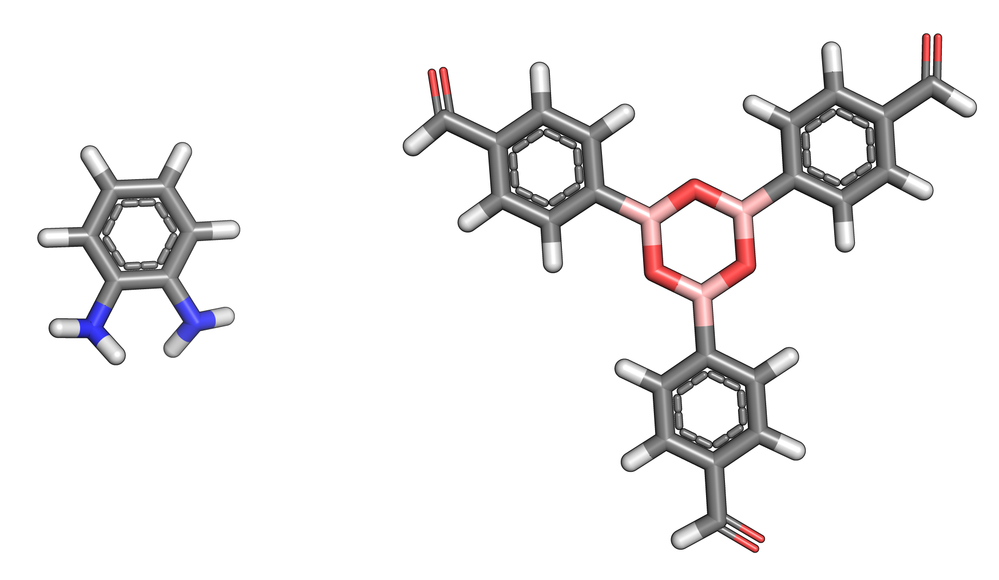
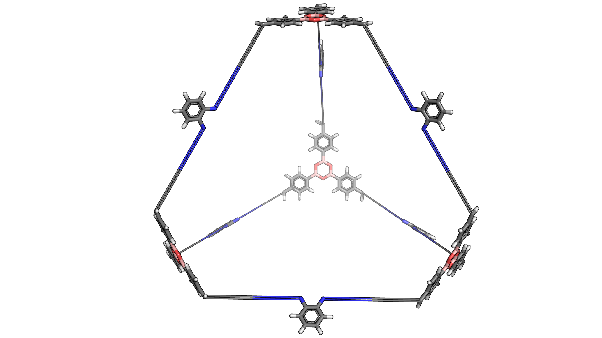

.. mtk documentation master file, created by
   sphinx-quickstart on Mon Nov 13 11:15:04 2017.
   You can adapt this file completely to your liking, but it should at least
   contain the root `toctree` directive.

Welcome to ``mtk``'s documentation!
===================================

.. toctree::
   :maxdepth: 2
   :caption: Contents:

Overview
--------

``mtk`` is a Python 3 library for building, manipulating, optimizing
and designing molecules.

Basic Examples
--------------

Linear Polymer
..............

The core function of ``mtk`` is to assemble molecules. Here is an example
of how a simple, linear polymer can be built. Starting with three monomers,
such as

.. image:: figures/monomers.png

each can be loaded into a :class:`.StructUnit2` object from a molecular
structure file:

.. code-block:: python

    monomer1 = StructUnit2('monomer1.mol', 'bromine')
    monomer2 = StructUnit2('monomer2.mol', 'bromine')
    monomer3 = StructUnit2('monomer3.mol', 'bromine')

The first argument is the path to the structure file and the second
argument specifies the functional group of the monomer.

To assemble a polymer only a single line of code is required:

.. code-block:: python

    polymer = Polymer([monomer1, monomer2, monomer3], Linear('ABC', [1, -1, 0], n=3))

Simply create a :class:`.Polymer` object by giving it a list of
monomers and a topology object, in this
case :class:`.Linear`. The topology object defines the the structure of
the polymer being assembled. The repeating unit is ``'ABC'``, the orientation
of the each monomer along the chain is parallel, anti-parallel and random, respectively, and
the number of repeating units is ``3``.

The assembled polymer can be written to a file

.. code-block:: python

    polymer.write('polymer.mol')

and will look like this.

.. image:: figures/polymer.png

Notice that the functional group has disappeared and been replaced by
new bonds between the monomers. The new bonds seem a little stretched,
so we can optimize the structure using an optimization function defined in
:mod:`~.optimization.optimization`, in this case :func:`.rdkit_ETKDG`

.. code-block:: python

    rdkit_ETKDG(polymer)

Again, the polymer can be written to a file

.. code-block:: python

    polymer.write('polymer_opt.mol')

and viewed

.. image:: figures/polymer_opt.png

Molecular Cages
...............

Molecular cages are relatively
exotic molecules that look like, yes, cages. Here is an example:

.. image:: figures/molecular_cage.png

Despite their apparent complexity, assembling a molecular cage is
extremely straightforward. In fact, it is done in exactly the same way
as a polymer.

First we define the building blocks of the cage:

.. code-block:: python

    bb1 = StructUnit2('bb1.mol', 'amine')
    bb2 = StructUnit3('bb2.mol', 'aldehyde')

Here is what they look like:

Notice a slight difference, while the first building building block still
uses the class :class:`.StructUnit2`, the second uses the class
:class:`.StructUnit3`. The reason is that the first building block has
2 functional groups while the second has 3 functional groups. Each class
defines a slightly different set of operations for manipulating the
positions of the building blocks when assembling the cage. This is
important so that the building blocks are placed exactly how we want them
when constructing a molecule. However, all of this happens behind the scenes
and a cage can be constructed through a simple one-liner:

.. code-block:: python

    cage = Cage([bb1, bb2], FourPlusSix())

Notice that this is exactly the same as the polymer example. To generate
a cage, we simply create a :class:`.Cage` object. We initialize it with
a list of building blocks and provide a topology instance, in this case
:class:`.FourPlusSix`. Unlike the :class:`.Linear` class, the :class:`.FourPlusSix`
does not require any additional arguments. Our assembled cage looks like
this

If we want to create a cage with a different topology but using the same
building blocks, we provide a different topology instance:

.. code-block:: python

    cage2 = Cage([bb1, bb2], EightPlusTwelve())

The assembled cage looks like a cube:

.. image:: figures/cage2.png

Notice that the building blocks are the same, only the shape has changed.
This is because a different topology instance was provided during initialization.

Here is a third example:

.. code-block:: python

    cage3 = Cage([bb1, bb2], Dodecahedron())

.. image:: figures/cage3.png

While we assembled some cages, the constructed structures are not
particularly realistic. We can optimize the geometry using an optimization
function:

.. code-block:: python

    macromodel_opt(cage, '/opt/schrodinger2017-4')
    macromodel_opt(cage2, '/opt/schrodinger2017-4')
    macromodel_opt(cage3, '/opt/schrodinger2017-4')

.. image:: figures/cages_opt.jpg

In this case the function :func:`.macromodel_opt` was used. We could have
used :func:`rdkit_ETKDG` again but chances are the structures would
have been optimized quite poorly. The :func:`macromodel_opt` function
requires a valid ``MacroModel`` installation with a working license.
The argument ``'/opt/schrodinger2017-4'`` is the path to the installation.

Covalent Organic Frameworks
...........................

Other Materials
...............

``mtk`` is a work in progress and currently supports only the above classes
of materials out of the box. However, ``mtk`` was designed to be easy
extend to other classes of molecules.
For a guide on how this can be done
see, .

Other Features
--------------

Calculating Molecular Properties
................................

Geometric Manipulations
........................

Dealing with Multiple Molecules
...............................

Automated Molecular Design with Genetic Algorithms
..................................................

Extending ``mtk``
-----------------

Each module of mtk has its own guidelines for adding new functionality.
However, in almost all cases adding new features to ``mtk`` only involves
defining a simple function in the appropriate module or a method in the
appropriate class.

    * :ref:`adding macromolecules`
    * :ref:`adding topologies`
    * :ref:`adding functional groups`
    * :ref:`adding energy functions`
    * :ref:`adding mutation functions`
    * :ref:`adding crossover functions`
    * :ref:`adding fitness functions`
    * :ref:`adding normalization functions`
    * :ref:`adding selection functions`
    * :ref:`adding exit functions`

Further Reading
---------------

    * :ref:`macromolecular assembly`

Indices and tables
==================

* :ref:`genindex`
* :ref:`modindex`
* :ref:`search`
