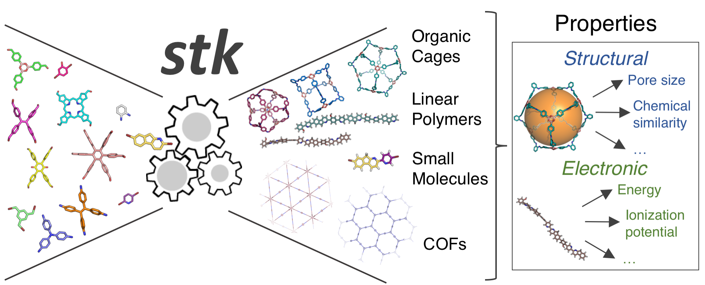

:author: Lukas Turcani

Requires Python 3.6.

The forks https://www.github.com/supramolecular-toolkit/stk and
https://github.com/JelfsMaterialsGroup/stk are placeholders. Please
use https://www.github.com/lukasturcani/stk for up-to-date code and submitting
any comments, bugs, pull requests etc.

This code was developed while doing my PhD in the Jelfs group,
http://www.jelfs-group.org/.

Overview
========

``stk`` is a Python library for building, manipulating, optimizing and
designing molecules. For more information, the documentation can be found at

Installation
============

Installation is simple and has 2 parts. First, installing stk, second,
installing any libraries it requires.

stk
---

1. Download ``stk`` from GitHub by clicking on the green "Clone or download"
   button and then on "Download ZIP".
2. Extract the downloaded zip file.
3. Using the terminal, go into the extracted directory and run:

.. code-block:: bash

    python setup.py install

4. ``stk`` should be installed, you can delete the downloaded and
   extracted folders.

dependencies
-------------

Apart from ``rdkit`` all dependcies of ``stk`` are listed in
``requirements.txt``. ``rdkit`` cannot be installed via pip so it is
listed separately.

rdkit
.....

The simplest way to get ``rdkit`` is to use the Anaconda distribution of
Python, which can be found on https://www.anaconda.com/download/. It
comes with a lot of scientific libraries already installed and the
conda package manager.

After installing Anaconda run

.. code-block:: bash

    conda install -c rdkit rdkit

If you do not want to use Anaconda, the best place to look for advice
on installing ``rdkit`` is https://github.com/rdkit/rdkit.

others
......

All other requirements can be installed with pip.

.. code-block:: bash

    pip install -r requirements.txt

Publications
============

about stk
---------

using stk
---------
