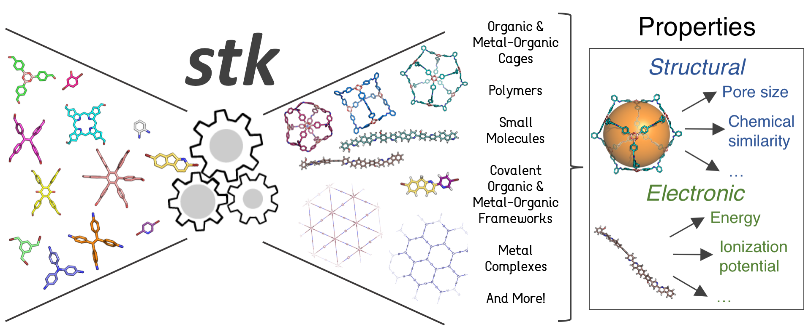

:author: Lukas Turcani
:Documentation: https://stk.readthedocs.io

Requires Python 3.6+.

Overview
========

``stk`` is a Python library which allows the construction,
manipulation, property calculation and automatic design of molecules.

Slack user group: https://t.co/LCPzWhvsVO

Installation
============

To get ``stk``, you can install it with pip::

    $ pip install stk

Make sure you also install rdkit, which is a dependency::

    $ conda install -c rdkit rdkit

Publications
============

about stk
---------

* `stk: A Python Toolkit for Supramolecular Assembly`_ | chemrxiv__

__ https://chemrxiv.org/articles/STK_A_Python_Toolkit_for_Supramolecular_Assembly/6127826

.. _`stk: A Python Toolkit for Supramolecular Assembly`: https://onlinelibrary.wiley.com/doi/abs/10.1002/jcc.25377

using stk
---------

* `An Evolutionary Algorithm for the Discovery of Porous Organic Cages`_ | chemrxiv__

__ https://chemrxiv.org/articles/An_Evolutionary_Algorithm_for_the_Discovery_of_Porous_Organic_Cages/6954557
.. _`An Evolutionary Algorithm for the Discovery of Porous Organic Cages`: https://pubs.rsc.org/en/content/articlelanding/2018/sc/c8sc03560a#!divAbstract

* `Machine Learning for Organic Cage Property Prediction`_ | chemrxiv__

__ https://chemrxiv.org/articles/Machine_Learning_for_Organic_Cage_Property_Prediction/6995018
.. _`Machine Learning for Organic Cage Property Prediction`: https://pubs.acs.org/doi/10.1021/acs.chemmater.8b03572

* `A High-Throughput Screening Approach for the Optoelectronic Properties of Conjugated Polymers`_ | chemrxiv__

__ https://chemrxiv.org/articles/A_High-Throughput_Screening_Approach_for_the_Optoelectronic_Properties_of_Conjugated_Polymers/6181841
.. _`A High-Throughput Screening Approach for the Optoelectronic Properties of Conjugated Polymers`: https://pubs.acs.org/doi/abs/10.1021/acs.jcim.8b00256

* `Computationally-Inspired Discovery of an Unsymmetrical Porous Organic Cage`_ | chemrxiv__

__ https://chemrxiv.org/articles/Computationally-Inspired_Discovery_of_an_Unsymmetrical_Porous_Organic_Cage/6863684
.. _`Computationally-Inspired Discovery of an Unsymmetrical Porous Organic Cage`: https://pubs.rsc.org/en/content/articlelanding/2018/nr/c8nr06868b#!divAbstract

* `Maximising the Hydrogen Evolution Activity in Organic Photocatalysts by co-Polymerisation`_

.. _`Maximising the Hydrogen Evolution Activity in Organic Photocatalysts by co-Polymerisation`: https://pubs.rsc.org/en/Content/ArticleLanding/TA/2018/C8TA04186E#!divAbstract

Acknowledgements
================

I began developing this code when I was working in the Jelfs group,
http://www.jelfs-group.org/, whose members often provide me with
very valuable feedback, which I gratefully acknowledge.
